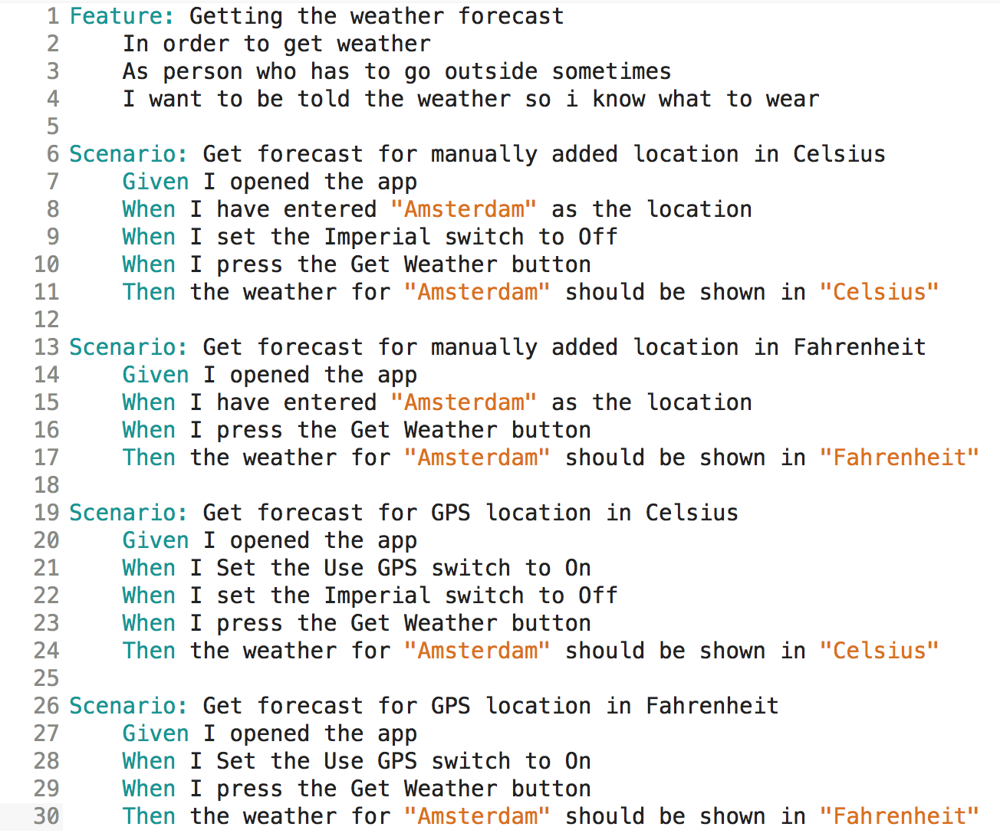
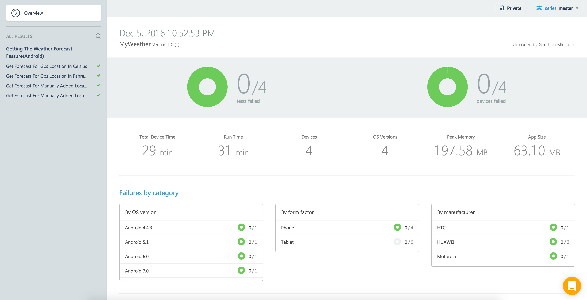
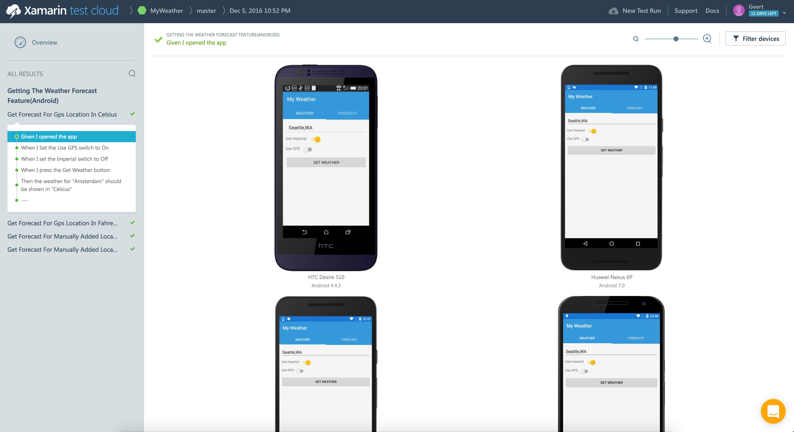

# Behavior Driven Development of Xamarin apps

This is a sample project created for a Xamarin University Guest lecture by @geertvdc on 8th of December 2016.
https://university.xamarin.com/guestlectures

This sample app uses Specflow and Xamarin Testcloud to create testable specifications that can be ran automated.
The tested app is a weather app made by James Montemagno for Xamarin Devdays 2016.

[Slides](https://github.com/Geertvdc/BDDXamarin/blob/master/BDD%20%26%20Specflow%20for%20Xamarin.pdf)

# Specflow Feature

# Testcloud results

